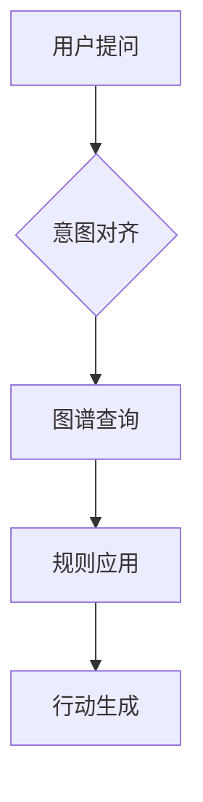

# Book Diagrams — 书内技术架构图规范（雾霁蓝 SVG + Mermaid）

> 适用于 sloth-press-den 技术/实操类书籍的书内技术图。
> 分层架构图用**雾霁蓝 SVG**（手工编写，借鉴 Cocoon architecture-diagram 的视觉语言自建配色体系）；流程/时序/状态图用 **Mermaid**（工坊内置渲染）；每章概念插图用 `book-illustration-workflow.md`（HTML手绘风+截图）。
> 首次实战验证：《本体即生产力》（2026-09，diagram-demo.html 三张样张）。

---

## 一、选型决策（先决定用什么画）

| 图型 | 工具 | 理由 |
|------|------|------|
| 分层架构图 / 系统组件图 / 技术栈图 | **雾霁蓝 SVG**（手工） | 配色完全可控、矢量清晰、贴合书籍排版 |
| 流程图 / 时序图 / 状态图 / 泳道图 | **Mermaid**（` ```mermaid ` 代码块） | 工坊构建时自动渲染，无需手工排版 |
| 每章概念插图（视觉隐喻） | book-illustration-workflow（HTML+Playwright截图PNG） | 已有成熟管线 |
| 细节清单 / 参数对比 | **表格**（不要画图） | L3细节优先用三线表，画图反而笨重 |

**原则**：能用表格讲清的细节不画图；一图一义，不为装饰画图。

## 二、设计系统（雾霁蓝）

### 配色表（唯一配色来源，暖金仅作点缀/强调）

```yaml
deep:    #3A4E66   深蓝灰 —— 标题条/主色块
mid:     #48607C   中蓝灰 —— 次级标题条
accent:  #5B9BC8   雾霁蓝 —— 强调/箭头/边框
gold:    #C8B99B   暖金   —— 消费层/高亮/价值回流（每图≤1处）
light:   #B4CDE1   浅蓝   —— 弱边框/分隔
page_bg: #F7F9FC   极浅蓝白 —— 画布底色（嵌入书稿时去掉，透明即可）
block_bg_1: #EDF4FA  浅蓝块（主层级背景）
block_bg_2: #F2F6FA  浅灰蓝块（次级背景）
block_bg_gold: #FBF8F1  暖金块（特殊层，配合gold描边）
text_main: #48607C  正文文字
text_sub:  #8899AA  次要文字/注释
text_on_deep: #FFFFFF 深色标题条上的文字
```

### 组件规范

| 组件 | 规格 |
|------|------|
| 层块（Layer Box） | `rx=10` 圆角矩形；外层浅色填充 + 1.2-1.5px 描边 |
| 标题条（Header Bar） | 层块顶部 32-34px 高，`deep`/`mid` 填充，白字14-15px加粗；标题条下方补一个 12px 同色矩形消除圆角漏白（`rx=10` 顶部圆角 + 下方矩形覆盖） |
| 技术位侧栏（Tech Sidebar） | 右侧独立金色块（`#FBF8F1` + `#C8B99B` 1.2px描边），竖排放工具/技术名，标题"技术位" |
| 箭头 | `stroke=#5B9BC8` 2px，marker 三角头；价值回流/反馈用金色虚线（`#C8B99B`，dasharray 6,4） |
| 文字 | 标题14-15px/700；正文13px；注释12px；辅助10-11px（极少用）；全用 PingFang SC |
| 间距 | 层块间留 40-50px 放箭头和标签；块内边距 20px |

## 三、三种经实战验证的布局模板

### 模板1：分层堆叠（三层语义架构类）

```
[左侧层级标签: 领域层/工程层/消费层]
┌────────────────────────────────────┐
│ 标题条(deep) 业务本体（领域层）       │
│ 内容区: 一句话定义 + 示例             │
└────────────────────────────────────┘
   ↓ 形式化表达 (accent箭头+标签)
┌────────────────────────────────────┐
│ 标题条(mid) 数据映射（工程层）        │
└────────────────────────────────────┘
   ↓ 统一接口
┌────────────────────────────────────┐
│ 标题条(gold) 语义层（消费层）         │  ← 暖金仅在此类"价值/消费"层
└────────────────────────────────────┘
右侧: 金色虚线向上箭头 "价值回流：消费驱动迭代"
```

### 模板2：分层 + 技术位侧栏（四层技术栈类）

```
┌──────────────────────┬─────────────┐
│ 层块1 (标题条deep)     │ 技术位(gold) │
│ 内容: 职责描述          │ GPT/Claude  │
├──────────────────────┼─────────────┤
│ 层块2 (标题条mid)      │ 技术位       │
├──────────────────────┼─────────────┤
│ 层块3                 │ ...          │
├──────────────────────┼─────────────┤
│ 层块4 (标题条deep)     │              │
└──────────────────────┴─────────────┘
层间: 居中向下accent箭头
```

### 模板3：横向流程（决策链路/处理管线类）

```
[步骤1] → [步骤2] → [步骤3] → [步骤4] → [步骤5]
(gold块)  (accent块) (mid块)   (mid块)   (accent块)
每步: 标题(①②③④) + 技术 + 说明
底部: 通栏注释块(light描边) 点明全图论点
```

## 四、插入书稿与编号

```markdown

```

- 图放 `assets/`，相对路径引用（press-typeset 构建时自动复制到 output/assets/）
- 图号按章编号：图X-Y（X=章号，Y=章内序号）；图注用斜体 `*图注*` 写在图下一行（会被自动识别为 figcaption）
- 交叉引用：`参见图X-Y`（自动转可点击）
- press-typeset 已处理：SVG 自动居中、`max-height: 150mm` + `object-fit: contain`（防止高图跨页截断）——**SVG 高度务必 ≤150mm，宽度按内容定**

## 五、与 Mermaid 的分工

```markdown

```

Mermaid 用于：七步法流程、同步流程、三阶段路线图、状态机。注意：
- 用 `flowchart`（不是 `graph`，新版本语法）
- 中文节点文字直接写，标题条配色由主题控制（雾霁蓝预设已内置）
- 构建 PDF 时渲染等待 10s，复杂图避免

## 六、检查清单（每张图交付前过一遍）

- [ ] 配色只用雾霁蓝系，暖金 ≤1 处（仅消费/价值层）
- [ ] 标题条圆角漏白已用同色矩形覆盖
- [ ] 文字不溢出（≥11px，长文本手动换行）
- [ ] 箭头方向与语义一致（向下=依赖/向上=回流），有箭头 marker
- [ ] 高度 ≤150mm（防跨页截断）
- [ ] 一图一义，无装饰性元素
- [ ] 图号、图注、交叉引用齐备
- [ ] SVG 文件放 assets/，正文相对路径引用

## 七、批量生产建议

- 每章开工前，先按 OUTLINE 列出本章需要的图清单（图号/标题/布局模板/内容要点）
- 分层架构图逐张手写 SVG（一次一章）；流程类直接写 mermaid 代码块，构建时渲染
- 全书图统一在 merge-book 之后、press-typeset 之前检查 assets/ 完整性（缺失图会静默空白——对照 SUMMARY 逐图核验）
