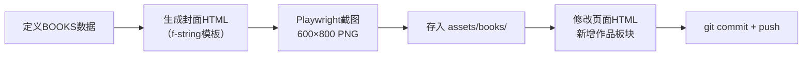

# Website Book Cover Images — Playwright批量生成封面图

> 用于在个人网站/关于页面展示书的封面截图。
> 与 PDF 封面生成（press-typeset.py）不同——这里生成的是**独立的600×800 PNG封面图**，
> 以 `` 嵌入 HTML 页面，而非嵌入 PDF。

---

## 适用场景

- 顾问/作者的 "关于我" 页面需要展示著作
- 网站首页/作品页展示多本书封面
- 需要有统一视觉风格的书封卡片（系列感）

## 工作流



## 封面HTML模板模式

使用 f-string + CSS 生成标准化封面，每本书不同配色：

```
[6px彩色顶条 — 书的主色渐变]
    ↓
[系列名]      ← 如「企业AI转型书系」
[书名]        ← 大号粗体
[副标题]      ← 中号字
[分隔线]      ← 主色
[作者名]
[标语]
    ↓
[60px彩色底栏 — 书的主色 + 「扫一扫」文案]
```

### 关键参数

| 参数 | 示例 | 说明 |
|------|------|------|
| `accent` | `#2C4A6E` | 顶条/底栏主色 |
| `accent2` | `#5B9BC8` | 渐变过渡+分隔线色 |
| `title` | Token账本 | 标题（32px粗体） |
| `subtitle` | AI转型，文化是最后的ROI | 副标题（16px） |
| `series` | 企业AI转型书系 | 系列名（13px，浅色） |

### 配色原则

每本书的配色与其主题匹配：

| 主题 | 色系 | 示例书 |
|------|------|--------|
| AI转型/技术 | 雾霁蓝 | Token账本 |
| 医药/供应链 | 墨绿 | 医药批发AI实战 |
| 领导力/决策 | 紫系 | AI领导者之路 |
| 知识管理 | 暖棕 | 知识飞轮 |
| 技能/实战 | 紫罗兰 | Skill工程实战 |
| 高管/AI | 钢蓝 | AI智能体 |

## Playwright截图要点

```python
from playwright.sync_api import sync_playwright

with sync_playwright() as p:
    browser = p.chromium.launch(headless=True)
    ctx = browser.new_context(viewport={"width": 600, "height": 800})
    for book in BOOKS:
        page = ctx.new_page()
        page.set_content(make_html(book))  # f-string生成的HTML
        page.wait_for_timeout(500)          # 等待字体/CSS渲染
        page.screenshot(path=str(out_path), full_page=False)
        page.close()
```

- **viewport** 设为封面输出尺寸（不要留空白）
- **`set_content()`** 够用——封面不引用外部图片，不需要 `goto('file:///...')`
- **`wait_for_timeout(500)`** 给字体渲染留时间（PingFang SC 等系统字体立即可用）
- **`full_page=False`** 按 viewport 裁剪，不含多余内容

## 在SPA中插入著作板块

给 `about` 页面（已有证书→著作→联系方式结构）新增一个板块：

```html
<div style="margin-bottom:48px;">
  <h3 style="...">我的著作</h3>
  <p style="...">把经验写成书的书系</p>
  <div style="display:grid;grid-template-columns:repeat(auto-fit,minmax(160px,1fr));gap:20px;">
    <!-- 每本书一张封面卡片 -->
    <div style="...">
      
      <p><strong>书名</strong><br>副标题</p>
    </div>
  </div>
</div>
```

布局用 `grid: repeat(auto-fit, minmax(160px, 1fr))` 自动适配屏幕宽度（6张桌面一排，移动端折叠）。

## 已验证案例

- **网站**：wangguobao0215.github.io（树懒老K个人站）
- **页面**：关于页面（`index.html`/#page-about）
- **书量**：6本
- **封面路径**：`assets/books/` 目录
- **效果**：证书区域之后、联系方式之前
